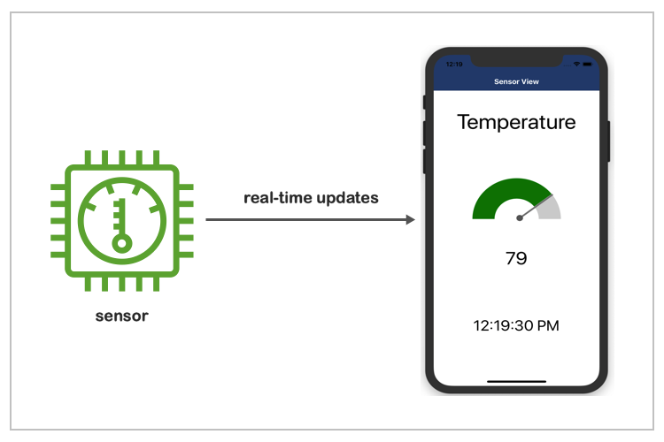
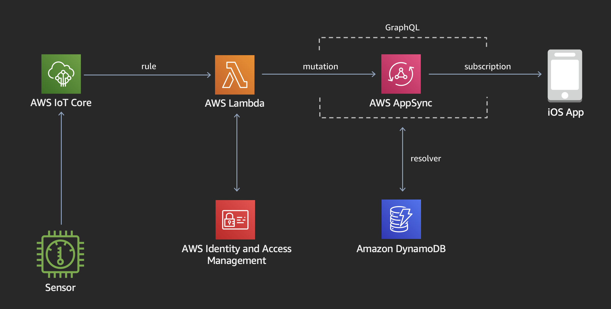

# aws-appsync-iot-core-realtime-example

This is an application that demonstrates an iPhone receiving real-time updates from an IoT sensor.  The solution is built with AWS Mobile and AWS IoT technologies.



## Architecture

1. The sensor component is developed with the AWS IoT Device SDK for Javascript.  The sensor is registered as a Thing in IoT Core and publishes a random temperature in a JSON payload to the Cloud every 2 seconds.

```json
{
    "sensorType": "Temperature",
    "value": 84,
    "timestamp": 1570562147790
}
```

2. A rule in IoT Core subscribes to the message topic and forwards the JSON payload to a Lambda function.

3. The Node js Lambda function executes a GraphQL mutatation in AppSync.  The mutation saves the latest value for the sensor in DynamoDB and broadcasts the latest value in real-time to the iOS application. The Lambda function uses an IAM role and policy to obtain permissions to interact with AppSync.

4. The React Native iOS application subscribes to the AppSync Sensor Update subscription.  When new temperature values are received, the gauge component on the screen is updated in real-time to reflect the new sensor value. The iOS application uses Cognito to authenticate users and allow them to perform the AppSync subscription. 

## Getting Started

### **Prerequisites**

1. A Mac with 
   - Xcode (^10.2)
   - Xcode iPhone Simulator enabled. (Simulators can be installed from the "Components" tab in Xcode Preferences)
   - Xcode Command-line Tools
   - CocoaPods

2. An AWS account in which you have Administrator access.

3. [Node JS](https://nodejs.org/en/download/) (^8.0) with NPM (^5.2)

4. [Amplify CLI](https://aws-amplify.github.io/docs/) (^3.11.0).

After you have installed and configured Amplify, take note of the AWS profile you selected during the configuration.  If you created a profile other than **default**, you will need the profile name for later steps in the deployment.

### **Installing**

If you run into issues installing or configuring anything in this project please checkout the [Troubleshooting](#troubleshooting) section below.


**Clone this code repository**

```
$ git clone https://github.com/dave-moser/sensor-view.git
```

**Switch to the mobile folder and initialize your Amplify environment**

```
$ cd sensor-view/mobile
$ amplify init

? Do you want to use an existing environment? No
? Enter a name for the environment: mysandbox
? Do you want to use an AWS profile? Yes
? Please choose the profile you want to use: default
```
Make sure you **do not** use an **existing environment**.  You must create a new environment (i.e. mysandbox).

When you select your profile, make sure to select the same profile you used when configuring Amplify.

**Deploy the app infrastructure to your AWS account**

```
$ amplify push

? Do you want to update code for your updated GraphQL API (Y/n) Y

? Do you want to generate GraphQL statements (queries, mutations and subscription) based on your schema types? This will overwrite your current graphql queries, mutations and subscriptions (Y/n) Y
```
You will then see a series of output as Amplify builds and deploys the app's CloudFormation Templates, creating the app infrastucture in your AWS account. 

Resources being created in your account include:

- AppSync GraphQL API
- DynamoDB table
- Cognito user pool
- Lambda functions (2)
- IoT Rules (2)

**Install the iOS app's Node js and CocoaPod packages**

```
$ npm install
$ npx react-native link
$ cd ios
$ pod install
$ cd ..
```

**Install the IoT Sensor**

Open a new terminal window then switch to the app's root folder (sensor-view/sensor). 

Install the Node js packages, and run the Node js app to create your sensor as a 'Thing' in AWS IoT Core.  It will also create and install the certificates your sensor needs to authenticate to IoT Core.

```
$ npm install
$ node create-sensor.js
```

*Note - this will create the sensor using your default AWS profile account and region.  If you have not specified a default region in your local AWS configuration, it will default to us-east-1.

If you do not have a **default** profile or you are using a profile other than **default**, run the app with an AWS_PROFILE environment variable specifiying the profile name you would like to use.

Replace [my-aws-profile] with the name of your profile:

```
$ AWS_PROFILE=[my-aws-profile] node create-sensor.js
```

## Run the App

**Start the IoT Sensor**

From the sensor terminal window:

```
$ node index.js
```
You will see output from the app as it connects to IoT Core and publishes new temperature messages every 2 seconds.

```
published to topic cmd/sensor-view/sensor-1570562080581/sensor-create {"sensorType":"Temperature","value":0,"timestamp":1570562143384}

published to topic dt/sensor-view/sensor-1570562080581/sensor-value {"sensorType":"Temperature","value":80,"timestamp":1570562145788}

published to topic dt/sensor-view/sensor-1570562080581/sensor-value {"sensorType":"Temperature","value":84,"timestamp":1570562147790}
```
Keep this app running and switch to your mobile terminal window.

**Start the iPhone app**

Switch back to the terminal window pointing to the mobile folder and run:

```
$ npx react-native run-ios
```
This will launch Xcode's iPhone simulator and a new terminal window that serves up the app.


**Sign-up and Sign-in**

The iOS app requires users to authenticate via Cognito.  The first screen you will see is a logon screen.  Tap the **Sign Up** link and then tap the link to **Create account** and create a new account using your email address.

Cognito will then email you a confirmation code.  Enter this code into the subsequent confirmation screen and logon to the app with your credentials.

**Use the App!**

You should now see a screen similar to the one at the top of this guide.  If you look at the terminal window running the sensor app, you shoud see the values being published to the Cloud reflected in the iPhone app's sensor gauge in real-time.

## Cleanup

Once you are finished working with this project, you may want to delete all of the resources it created in your AWS account.

Since you cannot delete your current environment, first switch back to the app's default **dev** environment.

```
$ amplify env checkout dev
```

Then remove the environment you created. Replace **[your-environment-name]** with the name you chose for your environment.

```
$ amplify env remove [your-environment-name]
? Do you also want to remove all the resources of the environment from the cloud? (Y/n) Y
```

## Troubleshooting

**Installing Amplify**
```
$ npm install -g @aws-amplify/cli
```

If you receive EACCES permisisons errors, make sure your system is setup properly to install global packages.  See this [Guide for options](https://docs.npmjs.com/resolving-eacces-permissions-errors-when-installing-packages-globally).

**Starting the iPhone App in the Simulator**
```
$ npx react-native run-ios
```

When the iPhone simulator first starts you may see a red error screen related to the URL.  This can occur if the simulator starts before the app in the terminal window finishes loading.  If you see this:

1. wait a few seconds
2. click on the simulator
3. hit the cmd-R key combination

This will cause the simulator to reload the app.

**Installing Pods or the Xcode Build**

If `pod install` or `npx react-native run-ios` give you errors outside of the simulator try ensuring Xcode Developer tools are installed via

```
$ xcode-select --install
```

Make sure CocoaPods are installed

```
$ sudo gem install cocoapods
```

If you get an error like "xcrun: error: unable to find utility “simctl”, not a developer tool or in PATH", ensure Xcode tools are pointing to your Xcode Application via

```
$ sudo xcode-select -s /Applications/Xcode.app 
``` 

## License

This sample code is made available under a modified MIT-0 license. See the LICENSE file.
