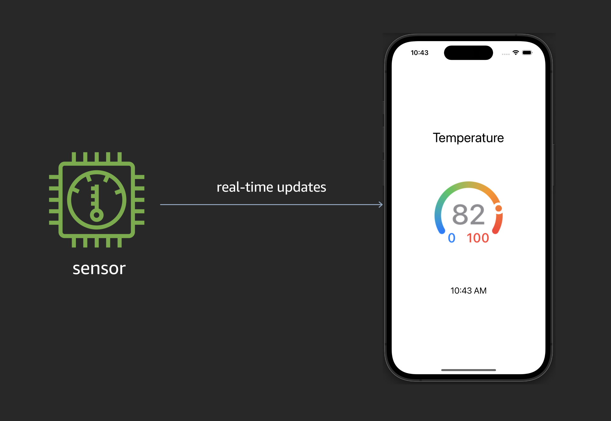

# AWS AppSync IoT Core Realtime Example

This application demonstrates an iPhone receiving real-time updates from an IoT sensor. The solution is built with AWS AppSync and AWS IoT Core technologies.

**Update!!** the project has been updated to use [**Amplify Gen2**](https://docs.amplify.aws/swift/) to deploy the backend services in AWS.



## Architecture


1. The sensor component is developed with the AWS IoT Device SDK for Javascript. The sensor is registered as a Thing in IoT Core and publishes a random temperature in a JSON payload to the Cloud every 2 seconds. The Thing Shadow also containes meta-data about then sensor specifying the _sensor type_ as Temperature.

```json
{
  "value": 84,
  "timestamp": 1570562147790
}
```

2. A rule in IoT Core subscribes to the message topic and forwards the JSON payload to a Lambda function.

3. The NodeJS Lambda function executes a GraphQL mutatation in AppSync. The mutation saves the latest value for the sensor in DynamoDB and broadcasts the latest value in real-time to the iOS application. The Lambda function uses an IAM role and policy to obtain permissions to interact with AppSync.

4. The iOS application uses the [Amplify Swift](https://github.com/aws-amplify/amplify-swift) package, built with the [AWS SDK for Swift](https://github.com/awslabs/aws-sdk-swift), to subscribe to the AppSync Sensor Value subscription. When new temperature values are received, the gauge component on the screen is updated in real-time to reflect the new sensor value.

## Getting Started

### **Prerequisites**

The following software was used in the development of this application. While it may work with alternative versions, we recommend you deploy the specified minimum version.

1. An AWS account in which you have Administrator access.

2. [AWS CLI](https://docs.aws.amazon.com/cli/latest/userguide/install-cliv2.html) (^2.21.1) the AWS Command Line Interface (CLI) is used to configure your connection credentials to AWS.

3. [Node.js](https://nodejs.org/en/download/current/) (^18.19.0) with NPM (^10.1.0)

4. [Xcode](https://developer.apple.com/xcode/) (16.1) Xcode is used to build and debug the mobile appliction application. You will need iOS Simulator 18.0 enabled.

### **Installation**

**Clone this code repository**

```
git clone https://github.com/aws-samples/aws-appsync-iot-core-realtime-example.git
```

**Switch to the mobile folder**

```
cd aws-appsync-iot-core-realtime-example/mobile
```

**Deploy the Infrastructure with Amplify Gen2**

```bash
npm install

npx ampx sandbox
```

The deployment is complete when you see the following output:

```bash
File written: amplify_outputs.json
```

Press **CTRL-C** to exit the deployment.

Resources created in your account include:

- AppSync GraphQL API
- DynamoDB table
- Lambda function
- IoT Rule

**Install the IoT Sensor Simulator**

Open a new terminal window then switch to the app's **sensor** folder (aws-appsync-iot-core-realtime-example/sensor).

Install the Node.js packages, and run the Node.js app to create your sensor as a **Thing** in AWS IoT Core. It will also create and install the certificates your sensor needs to authenticate to IoT Core.

From the **sensor** folder:

```
npm install
node create-sensor.js
```

## Run the App

### Start the IoT Sensor

From the **sensor** terminal window:

```
node index.js
```

You will see output from the app as it connects to IoT Core, transmits its shadow document, and publishes new temperature messages every 2 seconds.

```
connected to IoT Hub

published to shadow topic $aws/things/aws-iot-mobile-demo-sensor/shadow/update {"state":{"reported":{"sensorType":"Temperature"}}}

published to topic dt/sensor-view/aws-iot-mobile-demo-sensor/sensor-value {"value":77,"timestamp":1592073890804}

published to topic dt/sensor-view/aws-iot-mobile-demo-sensor/sensor-value {"value":76,"timestamp":1592073892807}

published to topic dt/sensor-view/aws-iot-mobile-demo-sensor/sensor-value {"value":77,"timestamp":1592073894810}
```

Keep this app running and switch to your mobile terminal window.

### Start the iPhone app

From the terminal window pointing to the **mobile** folder (aws-appsync-iot-core-realtime-example/mobile) and open the Xcode project:

```
open mobile.xcodeproj
```

**Add Amplify Configuration File to Xcode Project**

Open the mobile Xcode project and select **File/Add files to mobile** from th main menu. Select the **amplify_outputs.json** file generated by Amplify. Select the option to **Copy** the file and **mobile** as the Target.

Once the project loads in Xcode, select the "Run" arrow button to start the app.

**Use the App!**

You should now see a screen similar to the one at the top of this guide. If you look at the terminal window running the sensor app, you shoud see the values published to the Cloud reflected in the iPhone app's sensor gauge in real-time.

## Cleanup

Once you are finished working with this project, you may want to delete the resources it created in your AWS account.

From the **mobile** folder:

```
npx ampx sandbox delete
```

From the **sensor** folder:

```
node delete-sensor.js
```

## License

This sample code is made available under a modified MIT-0 license. See the LICENSE file.
